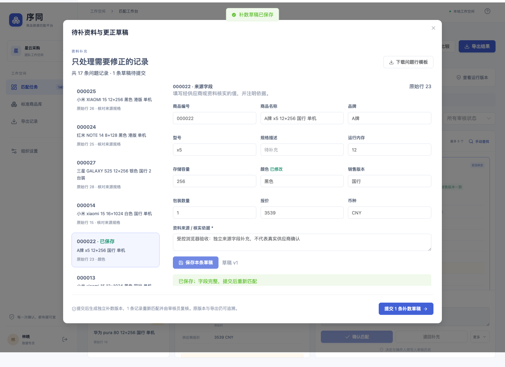

# 序同 商品数据匹配与核对平台 · 1.1

根据产品、技术方案及 2026 年 9 月 10 日优化方案实现的可运行项目。将供应商 CSV / XLSX 映射到已发布的手机标准商品库，经人工审核后导出可追溯结果。

已提供前后端、数据库迁移、独立后台执行、离线 LightGBM 训练、评测、自动化测试和 Docker Compose。当前交付默认使用规则匹配；训练模型已登记为实验版本，尚未达到手机业务的模型准入条件。

本轮新增：异步导入与映射模板、逐条补数草稿、来源编号版本比较、摘要列表与按需候选详情、冻结模型流水线、完整策略准入和影子评测。

- [优化版使用说明](docs/优化版使用说明.md)
- [优化交付验收报告](docs/优化交付验收报告.md)
- [标注与试用规范](docs/标注与试用规范.md)



## 立即运行

交付包包含已构建的网页。需要 Python 3.11 以上，推荐 Python 3.12。

```bash
python3 -m venv .venv
source .venv/bin/activate
pip install -r requirements.lock
python -m scripts.dev --seed
```

打开 <http://127.0.0.1:18765>。一个命令启动 API 和独立数据库任务执行器，数据保存在 `var/`。端口冲突时使用 `--port 18766`。Ctrl+C 结束本次启动的两个进程。

| 演示账号 | 角色 | 用途 |
| --- | --- | --- |
| operator@demo.local | 数据专员 | 导入、启动任务、导出 |
| reviewer@demo.local | 审核员 | 确认、退回补充、撤销 |
| admin@demo.local | 管理员 | 发布标准库、维护成员与方案 |
| admin@other.local | 另一组织管理员 | 验证组织隔离 |

演示密码统一为 `Demo2026!match`。这些账号和商品均为演示构造数据。默认双人复核：提交者不能审核自己的批次，管理员需兼任审核员才有审核权限，也不能绕过双人复核。

`samples/标准商品库.csv` 与 `samples/供应商商品表.csv` 可直接上传。第二份包含 30 行：29 行有效，1 行空名称需明确确认排除。样例覆盖相同型号不同容量、地区、包装数量、颜色缺失和无候选。

真实使用时，不运行演示初始化，改为创建自己的组织和初始管理员：

```bash
python -m scripts.bootstrap --org "你的组织" --email admin@example.com --name "管理员"
```

## 已实现的业务流程

1. 管理员或数据专员上传标准库、选择工作表和表头、配置字段；管理员发布不可变版本。
2. 数据专员上传供应商表，预览字段建议与逐行校验结果，明确确认排除错误行，生成不可变输入版本。
3. 选择标准库和方案提交运行，后台按 200 条分块计算，最多召回 20 个候选、页面显示 5 个。
4. 在三栏工作台核对原始记录、标准化字段、候选和差异。支持标准库人工搜索、逐条确认、最多 100 条批量确认、未匹配、补充资料和撤销。
5. 导出已确认映射或全量报告，支持 XLSX 和 CSV、保留原始列。文件使用冻结审核快照，之后撤销会标记旧导出已过时。
6. 逐条补数草稿提交后生成仅含修正记录的独立版本；修订来源、更新标准库、切换方案均创建新运行，可比较同一批次的变化并查看原运行清单。

品牌、型号、RAM、存储、颜色、销售版本、包装数量是手机的必核字段。缺失与冲突都不能直接确认。价格仅展示差异。CSV 中编号按文本解析；在 Excel 中直接打开文件需要保留单元格类型时，优先导出 XLSX。

## 技术结构

| 目录 | 内容 |
| --- | --- |
| `apps/web` | Vue 3 / TypeScript / Element Plus，响应式任务和审核页面 |
| `apps/api` | FastAPI 接口、认证、结构化错误、OpenAPI |
| `packages/domain` | SQLAlchemy 模型、组织上下文、导入、审核、导出快照 |
| `packages/matching` | 可版本化手机规则、字符 TF-IDF 检索、共享特征与推理 |
| `workers` | 数据库发件箱、Celery 任务、分块租约、取消与重试 |
| `db/migrations` | Alembic 增量迁移，复合外键、列表索引与有效映射唯一索引 |
| `ml` | 公开数据登记、训练/校准/消融、实体检索评测工具 |
| `models/abt-buy-v1` | 真实训练出的模型、分割清单、指标与错误分析 |
| `tests` | 规则、接口、并发、组织隔离、故障恢复测试 |
| `deploy` | 容器构建、Nginx 代理配置 |
| `docs` | 接口契约、操作说明、验收报告、截图与视频 |

本地便捷模式使用 SQLite WAL、本地对象文件及独立数据库轮询进程。Compose 模式切换为 PostgreSQL、Redis、Celery、MinIO，复用同一业务代码。运行状态始终来自数据库。

所有组织请求都需要当前有效成员关系。跨组织对象查询返回 404；复合外键阻止数据库层跨组织关联。审核采用数据库锁与 `expected_version`，同一版本并发提交只接受一次。批量审核逐条独立提交并保留幂等回执，中途退出后可继续提交。

## 前端开发

```bash
cd apps/web
pnpm install --frozen-lockfile
pnpm dev
```

开发页面使用 <http://127.0.0.1:5173>，代理到 18765 端口。`pnpm build` 执行 TypeScript 检查和正式构建。无需外部字体、图片服务或大模型 API。

## Docker Compose

```bash
python3 scripts/init_env.py
docker compose up --build -d
docker compose exec api python -m scripts.seed
```

打开 <http://localhost:8080>。初始化程序生成随机部署密钥，不覆盖已有 `.env`。不加载演示数据时，改用 `docker compose exec api python -m scripts.bootstrap ...` 创建账号。

Compose 包含数据库迁移和存储桶初始化；数据库、对象及应用数据均使用持久卷。部署步骤和 HTTPS、备份说明见 [运行维护](docs/运行维护.md)。当前机器没有 Docker，容器组合尚未实际启动验证；不要将本地 SQLite 测试视为 PostgreSQL 部署验收。

## 接口与测试

- 运行中的接口文档：<http://127.0.0.1:18765/api/v1/docs>
- 离线接口定义：[OpenAPI JSON](docs/openapi.json)
- 自动化测试：`python -m pytest -q`
- 浏览器操作测试：`node scripts/browser-test.mjs`，需在 `apps/web` 安装 Playwright 并执行 `pnpm exec playwright install chromium`。
- 标准性能样例：`python -m scripts.benchmark`
- 大容量与取消：`python -m scripts.benchmark --queries 10000 --catalog 50000 --verify-cancel --output docs/capacity-10000x50000.json`

完整实测结果、未测项目及与方案的差异见 [交付验收报告](docs/交付验收报告.md)。

## 模型与数据

```bash
python -m ml.data.prepare_abt_buy
python -m ml.train.train
python -m scripts.register_model models/abt-buy-v1
python -m ml.data.chinese_stress
```

macOS 上的 LightGBM 需要 OpenMP。若已安装 scikit-learn，可在训练前设置它自带的运行库路径：

```bash
export DYLD_LIBRARY_PATH="$(python -c 'import pathlib,sklearn; print(pathlib.Path(sklearn.__file__).parent / ".dylibs")')"
```

Linux 容器已安装 `libgomp1`。公开 Abt-Buy 数据使用官方训练/验证/测试切分；4 组固定参数搜索，验证集按来源 ID 分开调参、校准和阈值选择，报告 42/43/44 三个种子。实验模型只注册为 `EXPERIMENTAL`，不会改变线上默认策略。

公开数据压缩包没有附带明确的数据许可，交付包不再分发原始数据，提供源网址及 SHA-256 登记。记录对分类结果不能用作检索 Recall@20、中文手机精度或业务节时结论。详见 [模型实验报告](docs/模型实验报告.md)。

P1 语义召回、历史决定自动复用以及 P2 深度模型、ERP 连接未纳入此首版。真实人员试用、完整 WDC 实体级实测和生产部署验收仍需在对应数据与环境中完成。
