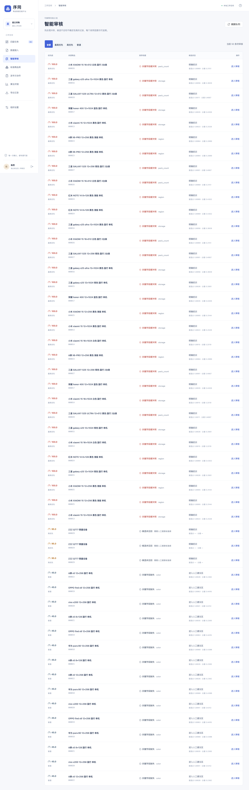
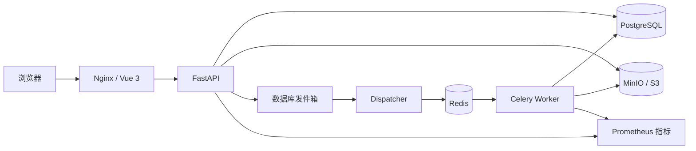
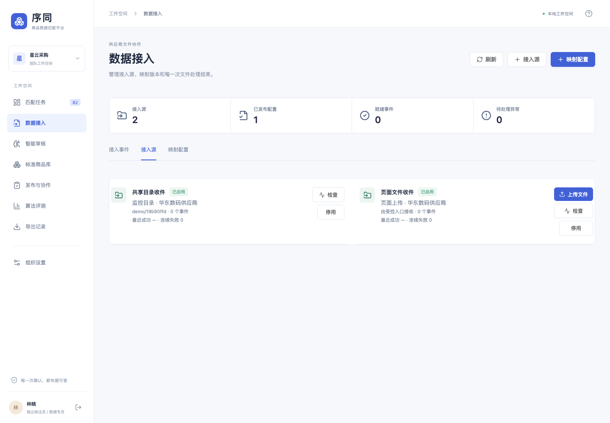
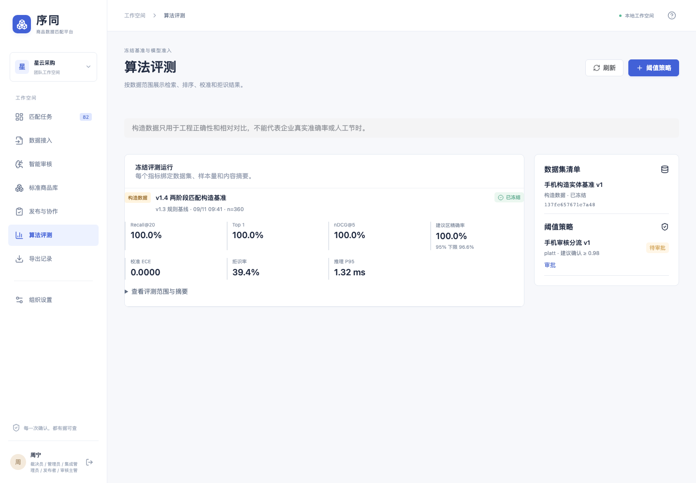

# 商品数据匹配与核对平台

面向企业商品主数据治理的匹配与人工核对平台。系统将供应商 CSV、Excel、目录、MinIO/S3 或签名 API 数据映射到已发布的标准商品库，完成自动候选召回、风险排序、双人复核、结果发布和全链路追溯。

当前版本：**v1.4**，示例业务域：**手机商品规格匹配**。



## 项目重点

- **多渠道数据接入**：支持页面上传、受控目录、S3/MinIO 和签名 API；按来源、文件摘要和配置版本去重。
- **版本化数据治理**：标准库、供应商字段映射、输入数据、审核标签、算法策略和评测结果均保留版本，支持试运行、发布及回退。
- **可解释商品匹配**：基于品牌、型号、内存、存储、颜色、销售版本和包装数量生成候选；硬冲突不会被自动确认。
- **风险驱动的人工审核**：按规格冲突、无候选、字段缺失和候选分差排序，展示字段级依据与相似历史案例。
- **可靠的后台任务**：Celery + Redis 执行分块匹配，结合数据库发件箱、租约、执行令牌、幂等回执和失败重放，降低重复提交与任务丢失风险。
- **可追溯发布与交付**：审核结果可导出 CSV/XLSX，保留原始列、冻结快照、发布版本、撤销状态和接收端回执。
- **企业级隔离与审计**：组织级数据隔离、角色权限、双人复核、并发版本控制、结构化审计记录和服务账号限流。
- **算法评测与准入**：冻结数据集上计算 MRR、nDCG@5、拒绝率、硬冲突数及延迟分位数；阈值需审批后才影响新任务。

## 解决的问题

| 业务痛点 | 平台能力 |
| --- | --- |
| 不同供应商字段、命名和规格表达不一致 | 可发布、可回退的字段映射与数据转换配置 |
| 人工逐行比对速度慢且容易漏掉关键规格 | 候选召回、风险排序和字段级差异说明 |
| 自动匹配结果难以解释 | 展示命中依据、硬冲突、候选分差和历史相似案例 |
| 审核结论依赖个人经验，过程无法复盘 | 双人复核、版本化标签、不可变输入和完整审计记录 |
| 批量任务中断后容易重复处理或丢失结果 | 分块执行、租约恢复、幂等事件和失败重放 |
| 导出后无法确认使用的是哪一版数据 | 冻结审核快照、发布版本、文件摘要和交付回执 |
| 算法调整缺少统一验收标准 | 冻结评测、版本对比和阈值准入流程 |

## 核心流程

1. 发布标准商品库，并确定手机商品的必核规格。
2. 上传供应商文件或建立目录、S3/MinIO、签名 API 接入源。
3. 试运行字段映射和校验规则，确认后发布接入配置。
4. 系统异步生成匹配候选，并按风险进入智能审核队列。
5. 审核员确认、改选、退回补资料或标记无匹配；默认执行双人复核。
6. 发布已确认映射，导出冻结结果并跟踪下游接收回执。
7. 将合格审核标签纳入冻结评测，审批新的匹配阈值。

## 系统架构



本地便捷模式使用 SQLite WAL、本地对象目录和数据库队列；Docker Compose 模式使用 PostgreSQL 16、Redis 7、Celery 和 MinIO，业务代码保持一致。

## 界面预览

| 数据接入 | 智能审核 | 算法评测 |
| --- | --- | --- |
|  |  |  |

## 本地快速运行

需要 Python 3.11 以上，推荐 Python 3.12。仓库包含已构建的前端资源。

```bash
python3 -m venv .venv
source .venv/bin/activate
pip install -r requirements.lock
python -m alembic upgrade head
python -m scripts.seed
python -m scripts.demo_enterprise
python -m scripts.demo_v14
python -m scripts.dev
```

打开 <http://127.0.0.1:18765>。`scripts.dev` 会同时启动 API、后台任务调度器和接入轮询器，数据保存在 `var/`。

### 演示账号

| 账号 | 角色 | 主要操作 |
| --- | --- | --- |
| `operator@demo.local` | 数据专员 | 导入、启动任务、导出 |
| `reviewer@demo.local` | 审核员 | 确认、退回补充、撤销 |
| `admin@demo.local` | 管理员 | 发布标准库、维护成员与方案 |
| `admin@other.local` | 另一组织管理员 | 验证组织隔离 |

演示密码为 `Demo2026!match`，账号和商品均为构造数据。可以直接使用 `samples/标准商品库.csv` 和 `samples/供应商商品表.csv` 体验完整流程。

真实环境不要运行演示初始化命令，应创建独立组织和管理员：

```bash
python -m scripts.bootstrap --org "你的组织" --email admin@example.com --name "管理员"
```

## Docker Compose 部署

安装 Docker Desktop 或兼容的 Docker Compose 运行环境后执行：

```bash
python3 scripts/init_env.py
docker compose up --build -d
docker compose exec api python -m scripts.bootstrap \
  --org "你的组织" --email admin@example.com --name "管理员"
```

打开 <http://localhost:8080>。初始化脚本会生成随机部署密钥且不会覆盖已有配置。Compose 会完成数据库迁移、MinIO 存储桶初始化，并启动 API、网页、Celery Worker、Dispatcher 和接入轮询器。

监控栈包含 Prometheus、Grafana 和 PostgreSQL Exporter：

```bash
docker compose -f compose.yaml -f deploy/compose.monitoring.yaml \
  --profile monitoring up --build -d
```

Prometheus 默认监听 `127.0.0.1:19090`，Grafana 默认监听 `127.0.0.1:13000`。告警规则已提供；实际告警到人还需接入 Alertmanager 及企业微信、钉钉、邮件或其他 Webhook 接收端。

## 技术栈

| 模块 | 技术 |
| --- | --- |
| Web | Vue 3、TypeScript、Element Plus、Vite |
| API | FastAPI、SQLAlchemy、Alembic、Pydantic |
| 数据库 | PostgreSQL 16；本地模式支持 SQLite WAL |
| 异步任务 | Celery、Redis、数据库发件箱 |
| 对象存储 | MinIO / S3；本地模式支持文件目录 |
| 匹配与模型 | RapidFuzz、scikit-learn、LightGBM |
| 监控 | Prometheus、Grafana、PostgreSQL Exporter |
| 测试 | Pytest、Playwright、TypeScript 检查 |

## 项目目录

| 目录 | 内容 |
| --- | --- |
| `apps/web` | Vue 3 管理端和审核工作台 |
| `apps/api` | FastAPI 接口、认证、指标和 OpenAPI |
| `packages/domain` | 导入、审核、发布、交付及组织隔离 |
| `packages/matching` | 商品规格规则、候选召回、特征与推理 |
| `workers` | Celery 任务、Dispatcher、租约及重试 |
| `db/migrations` | Alembic 数据库迁移与约束 |
| `ml` | 数据准备、训练、校准和评测工具 |
| `deploy` | Docker、Nginx、Prometheus 和 Grafana 配置 |
| `tests` | 业务、权限、并发、恢复和算法测试 |
| `docs` | 使用说明、接口契约和验收证据 |

## 验证状态

- 后端测试：`103 passed, 1 skipped`
- v1.4 专项测试：`6 passed`
- Vue/TypeScript 正式构建通过
- 数据库全新迁移、降级和再次升级通过
- 桌面端与移动端浏览器流程通过
- 智能审核队列查询由 261 条 SQL 降至 18 条（82 条待审核记录）

以上结果基于本仓库的构造数据和本地环境。实验 LightGBM 模型尚未达到手机业务准入标准，不会替换默认规则策略；真实业务准确率、人工节时、企业单点登录、高可用数据库和跨主机恢复需要在企业环境继续验证。

## 文档

- [v1.4 使用说明](docs/v14/使用说明.md)
- [v1.4 验收报告](docs/v14/验收报告.md)
- [v1.4 运行与待验收](docs/v14/运行与待验收.md)
- [数据库部署与验收说明](docs/v13-database/部署与验收说明.md)
- [运行维护](docs/运行维护.md)
- [离线 OpenAPI 定义](docs/openapi.json)

常用验证命令：

```bash
python -m scripts.test -q
pnpm -C apps/web build
python -m alembic current
python -m scripts.poll_ingestion --once
```
