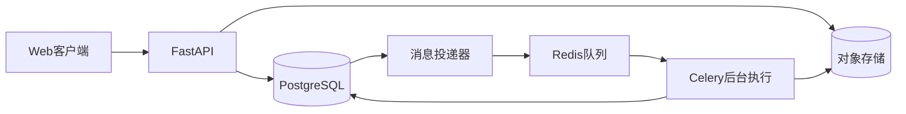

# 商品数据匹配与核对平台技术方案

版本 1.0　日期 2026年9月10日　对应产品方案 1.0

本方案面向项目开发与算法实现，规定系统边界、数据结构、接口、任务一致性、匹配算法、评测协议及部署方式。首版将供应商商品记录关联到一个已发布的标准商品库版本，所有正式映射经人工审核后导出。

采用Python模块化单体和独立后台执行进程。先用规则匹配跑通业务，再训练轻量模型，并依据独立实验决定是否增加语义召回和深度模型。所有数值目标均为待验证预算，不作为已实现性能或模型成绩。

## 1 架构与技术选择

### 1.1 系统组成

浏览器通过HTTPS访问Vue页面和FastAPI。API负责登录、组织授权、导入配置、审核事务和任务提交；后台执行进程负责解析、标准化、建索引、匹配和导出。PostgreSQL保存业务事实；Redis承载任务消息；对象存储保存原文件、模型和导出文件。

业务写入与任务发送通过数据库任务发件箱衔接。匹配模块在后台进程内加载模型，不为首版额外拆分推理微服务。在线系统不必调用大模型API。



| 层次 | 选型 | 选择理由 |
| --- | --- | --- |
| 前端 | Vue 3、TypeScript、Element Plus | 适合导入向导、表格和审核表单 |
| API | FastAPI、Pydantic、SQLAlchemy 2、Alembic | 延续现有Python经验，明确数据契约 |
| 业务数据库 | PostgreSQL | 事务、约束、结构化字段和JSONB |
| 后台执行 | Celery、Redis、任务发件箱轮询器 | 将长任务移出请求，并支持故障恢复 |
| 文件 | 本地开发使用S3兼容存储服务 | 原文件和导出文件统一授权访问 |
| 基线与模型 | RapidFuzz、scikit-learn、LightGBM | CPU可实现规则比较和监督学习 |
| 可选增强 | 本地文本向量模型、Cross-Encoder | 在独立实验支持收益后加入 |
| 部署与观测 | Docker Compose、结构化日志、指标端点 | 单机可复现，便于定位阶段耗时 |

数据库是真实状态来源，不能依赖Celery结果存储判断业务是否已完成。首版保持一套API代码和一套数据库，导入、目录、匹配、审核、权限模块通过明确接口协作。

### 1.2 业务流程中的组件关系

浏览器提交文件 → API登记文件与批次 → 后台解析并校验 → 用户确认字段映射 → API冻结输入和标准库版本 → 后台检索与打分 → 审核事务保存决定 → 后台生成导出快照。

API提交任务时只保存参数和发件箱记录。轮询器向Redis投递任务后标记已投递；重复投递由执行端幂等处理。Redis中断时，已提交任务留在发件箱中等待恢复。

## 2 领域模型与核心约束

### 2.1 对象关系

组织拥有成员、标准库、供应商批次和运行。标准库下有多个不可变版本，每个版本包含标准商品；一个供应商批次版本包含多条来源记录。匹配运行绑定一个来源版本和一个标准库版本，每条来源记录生成一个匹配条目及若干候选。审核事件改变条目的有效决定，正式映射与审核事件在同一事务中写入。

一条来源记录最多拥有一个当前有效映射。不同供应商记录可以关联到同一标准商品；标准商品不因被匹配而从其他候选中移除。首版不求解全局一对一分配，也不自动创建标准商品。

### 2.2 数据表

所有业务表使用UUID主键和UTC时间；租户表必须包含org_id。下表字段是开发所需的核心字段，数据库迁移还应补齐非空、外键、索引和时间戳。

| 表 | 核心字段 | 用途 |
| --- | --- | --- |
| organizations / users | id、name / email、password_hash、active | 组织与账号 |
| memberships | org_id、user_id、roles、active | 组织成员及角色 |
| files | org_id、object_key、sha256、size、media_type | 原文件与授权归属 |
| catalogs | org_id、name、active_version_id | 标准商品库入口 |
| catalog_versions | org_id、catalog_id、version、status、content_hash | 不可变库版本 |
| catalog_products | org_id、version_id、sku、raw、normalized、fingerprint | 标准商品和规格 |
| batches | org_id、supplier_ref、created_by、active_revision_id | 供应商批次入口 |
| batch_revisions | org_id、batch_id、file_id、column_mapping、status、content_hash | 输入版本与字段配置 |
| source_records | org_id、revision_id、row_no、source_sku、raw、normalized、issues | 逐行来源与质量问题 |
| match_runs | org_id、revision_id、catalog_version_id、manifest、status、cancel_requested | 一次不可变计算定义 |
| run_chunks | org_id、run_id、chunk_no、status、lease_until、fence_token | 分块执行与恢复 |
| match_items | org_id、run_id、source_id、suggestion、current_decision_id、version | 推荐结果和审核并发控制 |
| candidates | org_id、item_id、product_id、rank、score、features、conflicts | 候选与依据 |
| review_events | org_id、item_id、seq、action、product_id、reason、actor_id | 追加式审核历史 |
| mappings | org_id、item_id、decision_id、source_id、product_id、valid_to | 已确认关系及撤销 |
| exports / export_rows | org_id、run_id、kind、status、snapshot_hash / export_id、row_no、冻结的输出字段 | 一致的导出快照 |
| derived_artifacts | org_id、input_id、input_kind、rule_version、object_key、sha256 | 按规则版本保存派生数据 |
| model_versions / policies | artifact_hash、schema_version、metrics / 阈值及规则版本 | 模型和匹配策略 |
| audit_logs / outbox | actor、action、resource、request_id / event_key、payload、published_at | 审计与任务可靠投递 |

## 3 约束 索引与审核事务

### 3.1 防止跨组织和重复记录

组织相关表对(org_id, id)设置唯一约束，跨表关联优先使用包含org_id的复合外键，阻止组织A的运行引用组织B的文件或标准库。org_id从当前已验证成员关系取得，不信任请求正文中的组织字段。

| 约束或索引 | 定义与目的 |
| --- | --- |
| 成员唯一性 | memberships(org_id, user_id)唯一 |
| 标准编号 | catalog_products(org_id, version_id, sku)唯一 |
| 来源行号 | source_records(org_id, revision_id, row_no)唯一 |
| 运行结果 | match_items(org_id, run_id, source_id)唯一 |
| 候选去重 | candidates(org_id, item_id, product_id)唯一 |
| 审核顺序 | review_events(org_id, item_id, seq)唯一 |
| 有效映射 | mappings(org_id, item_id)在valid_to为空时唯一 |
| 任务分块 | run_chunks(org_id, run_id, chunk_no)唯一 |
| 列表查询 | match_runs(org_id, created_at, id)；match_items(org_id, run_id, suggestion, id) |
| 消息去重 | outbox(event_key)唯一；幂等键按组织、账号和路由限定 |

跨运行的相同来源记录可以保留不同历史映射。导出始终显式选择一个运行，不能将多个运行的有效关系无条件拼接。标准编号和来源编号存为文本，金额使用Decimal或NUMERIC，避免浮点误差。

### 3.2 审核事务

审核请求必须携带expected_version。服务端校验成员和角色、双人复核约束、运行成功状态、候选或人工选择商品的组织及库版本、关键字段冲突。随后以SELECT FOR UPDATE锁定match_items行，再次核验版本。

在同一事务中追加review_events，关闭旧有效mapping，必要时创建新mapping，更新当前决定并增加version，写入audit_logs。任何一步失败都回滚；版本不符返回409并附最新版本。即便管理员兼任审核员，也执行相同检查。

确认、改选、标记未匹配、退回补充和撤销均为独立动作。撤销关闭有效关系并留下新事件；不删除原审核记录。不允许直接更新候选分数或历史事件来修改结论。

### 3.3 批量审核与导出一致性

批量审核最多100条，提交明确的条目ID和版本列表。逐条独立事务处理，返回每条成功、冲突或禁止原因，前端不能把部分成功显示为全部成功。服务端对每条重新检查条件。

导出创建时在REPEATABLE READ事务中将所选有效关系和输出字段复制到export_rows，并登记导出任务。生成器只读取冻结行，不在生成中追读最新审核状态。保存筛选条件、条数和快照摘要；后续撤销不会改变已生成文件的历史内容。

## 4 接口契约

### 4.1 通用约定

接口前缀为/api/v1。采用短期访问令牌与可撤销刷新会话，刷新令牌哈希存储，浏览器通过HttpOnly Cookie持有刷新令牌。每次业务请求校验账号、组织成员状态及角色；停用成员不会因旧令牌尚未到期而继续访问。

创建运行、批量审核和创建导出要求Idempotency-Key。相同范围内相同键和相同请求摘要返回原响应；相同键但不同正文返回409。键保留24小时，业务唯一约束长期存在。

列表使用游标分页，默认50条、最多100条，以时间和ID或稳定排序键翻页。错误响应包含code、message、request_id和必要的字段详情；后台堆栈不返回浏览器。跨组织对象统一返回404，避免泄漏其存在性。

### 4.2 主要接口

| 方法与路径 | 输入要点 | 返回与限制 |
| --- | --- | --- |
| POST /auth/login | 账号、密码 | 会话与访问令牌，登录限流 |
| GET /memberships | 无 | 当前用户有效组织和角色 |
| POST /files | multipart文件 | 201，文件ID、摘要、大小 |
| POST /catalogs | 名称 | 201，标准库ID |
| POST /catalogs/{id}/versions | 文件、工作表、字段映射 | 202，校验版本ID |
| POST /catalog-versions/{id}/publish | expected_version | 管理员发布，错误行未处理则拒绝 |
| POST /batches | 供应商、文件、工作表 | 201，批次与初始修订ID |
| POST /batches/{id}/revisions | 文件或修正、字段映射、排除行 | 202，新输入版本 |
| GET /revisions/{id}/preview | 游标、过滤条件 | 原始行、标准化字段及问题 |
| POST /runs | revision_id、catalog_version_id、policy_id | 202，运行ID及状态 |
| GET /runs/{id} | 无 | 状态、进度、阶段错误与版本信息 |
| POST /runs/{id}/cancel | 取消原因 | 202，取消请求已登记 |
| POST /runs/{id}/retry | 原运行ID | 202，新运行ID，记录重试来源 |
| GET /runs/{id}/items | 推荐状态、审核状态、游标 | 条目与简要候选 |
| GET /items/{id}/candidates | 无 | 候选、依据、冲突和评分详情 |
| GET /catalog-versions/{id}/products | 关键词、游标 | 人工查找标准商品 |
| POST /items/{id}/decisions | action、product_id、reason、expected_version | 201，当前决定与新版本 |
| POST /runs/{id}/bulk-decisions | 明确的条目和版本列表 | 200，逐条结果，最多100条 |
| POST /runs/{id}/exports | kind、过滤条件、输出列 | 202，导出ID与冻结条数 |
| GET /exports/{id}/download | 无 | 校验权限后流式下载 |

### 4.3 审核请求示例

```json
{
  "action": "confirm",
  "product_id": "标准商品UUID",
  "reason": "型号和关键规格已核对",
  "expected_version": 3
}
```

成功返回decision_id、item_version、status。主要错误码包括VALIDATION_ERROR、VERSION_CONFLICT、SPEC_CONFLICT、SELF_REVIEW_DENIED和RUN_NOT_READY。退回补充或撤销时reason必填；confirm必须提供商品ID。

## 5 后台任务与状态机

### 5.1 状态转换

批次修订状态为DRAFT、VALIDATING、READY、INVALID；READY之后的内容不可修改。匹配运行状态为QUEUED、RUNNING、SUCCEEDED、FAILED、CANCEL_REQUESTED、CANCELLED。有效转换为排队到运行或取消，运行到成功、失败或取消中，取消中到已取消。终态不回到运行态。

输入错误行在运行前由用户明确排除。运行中的未恢复分块错误使整次运行FAILED；部分结果仅供诊断，不开放审核或正式导出。人工点击重试新建运行；系统内的瞬时错误重试保留当前运行。

### 5.2 分块 租约与重复执行

来源记录按200条分块。初始每组织最多1个活动匹配运行，全实例最多2个；其余排队。并发占用在数据库事务中领取，不能只依赖进程内计数或Redis锁。

执行端从数据库领取分块，更新lease_until并递增fence_token。计算期间定期续租；写入结果时再次比较token、租约和运行取消状态。失去租约的旧进程不能提交结果。分块输出及完成状态在同一事务提交，并用唯一键保证重复消息不生成重复结果。

初始租约120秒、每20秒心跳一次；实际根据最慢分块耗时调整。后台巡检回收过期租约。导入和导出也须幂等：结果先写临时对象，完整写入后以数据库登记的对象键发布，未引用的临时对象定期清理。

### 5.3 错误与取消

网络或临时存储错误最多重试3次，采用10秒、30秒、90秒加随机抖动的退避。格式错误、字段不合法、模型特征版本不兼容不做盲目重试。单块持续失败导致整次运行失败，并保留错误类型和请求编号。

取消接口在数据库中登记请求。执行端在块边界及每20条记录检查取消标记，停止新工作；提交结果前再次检查。单条推理设置超时，取消响应时间作为压力测试项。最终置CANCELLED前确认无仍可提交结果的有效执行者。

### 5.4 运行清单

每次运行保存输入文件摘要、字段映射版本、标准化规则版本、类别配置、标准库版本及摘要、候选索引版本、模型文件摘要、特征schema、阈值策略、复核策略和代码提交号。manifest不可修改；模型更新后新建运行，历史运行仍可定位原有资产。双人复核默认开启，组织设置更新只影响之后创建的运行。

## 6 数据标准化与候选检索

### 6.1 标准化结构

统一记录字段为name、brand、model、category、specs、pack_count、price和currency，并保留raw原文、原始行号和每个字段的提取来源。specs按类别保存RAM、storage、color、region等字段，缺失值独立表示，不用零代替。

导入时保存的normalized作为预览缓存，并记录对应规则版本。运行使用按输入版本和规则版本生成的derived_artifacts；更换标准化规则时生成新资产，不能覆盖历史来源记录或让旧运行读取新的缓存。

先做Unicode NFKC、空白处理、大小写归一和经版本管理的品牌别名转换。型号必须保留可区分产品的字符。容量、尺寸和包装数量按明确规则解析；不把GB与GiB、套装与单件直接等同。字段抽取失败只添加问题标记，不填造值。

价格仅用于业务差异展示，首版不作为决定商品身份的核心特征。即使价格接近，也不能抵消型号或容量冲突。已知且可靠的关键字段冲突单独保留为禁止直接确认的约束。

### 6.2 CPU候选检索基线

对选定组织和标准库版本建立索引。第一路通过标准化品牌、型号和可信商品编码召回；第二路对名称及关键规格建立字符2至4元TF-IDF稀疏向量，用分块稀疏相似度检索候选。各路候选合并去重，再按冻结的召回分数选前20个。

不能对缺失品牌强制分桶，否则可能丢掉真实匹配。对明确冲突的结果保留必要诊断信息，但不将其作为可直接确认的推荐。没有任何候选时可按更宽条件检索一轮，并标记来源；禁止无限扩展。

每个候选集只包含本组织、本标准库版本的商品。索引缓存键包含org_id、catalog_version_id和索引文件摘要；不在全租户检索之后仅过滤返回结果。执行时逐小批处理，不将全部来源与全部标准库展开为稠密笛卡尔积。

### 6.3 语义召回扩展

P1可增加一个本地多语言文本向量模型，对候选取并集，并用RRF或固定融合策略排序。记录模型名称、revision、维度、文本模板和归一化方式。更换向量模型必须重建索引，不混用不同版本的向量。

实验先衡量Recall@20、查询耗时和内存。若相同候选数量下语义召回没有稳定改善，保留CPU基线。对可用候选不足的来源记录，额外报告补召回带来的收益及误候选数。

## 7 匹配模型与训练

### 7.1 特征和监督任务

将一条来源商品与一个候选标准商品组成记录对，预测是否为同一销售SKU。首版训练LightGBM二分类器，与固定规则分数比较；不把“使用过一个向量模型”当作监督训练成果。

| 特征组 | 示例 | 注意事项 |
| --- | --- | --- |
| 名称 | 字符相似度、词集合重合、TF-IDF余弦 | 区分长描述与型号信息 |
| 标识 | 品牌相同、型号完全一致、型号部分一致 | 缺失与不一致分别编码 |
| 规格 | RAM、容量、颜色、地区、包装的相同与冲突标记 | 关键冲突不由总分覆盖 |
| 完整性 | 两边关键字段覆盖率、抽取失败标记 | 数据不足时避免高推荐 |
| 检索来源 | 精确召回、文本召回及对应分数 | 在独立测试中检查依赖程度 |
| 可选语义 | 名称及规格向量相似度 | 冻结模型与文本模板 |

特征函数在训练和推理中共用，保存feature_schema_version、字段顺序、缺失处理和依赖版本。训练标签为match或non_match；无法判定的记录不当作负样本，保留为unresolved。

### 7.2 训练流程

1. 登记原始数据、许可、文件摘要和切分清单；先冻结测试集。
2. 在训练部分拟合特征处理和模型。采用已标注的难负样本，例如同型号不同容量；只在标签明确时新增难负样本。
3. 比较逻辑回归或固定规则与LightGBM。初始尝试num_leaves为15或31、max_depth为5或8、learning_rate为0.03或0.1，使用早停控制训练。
4. 验证集按产品分组划出调参、校准和策略选择用途；数据不足时使用分组交叉验证产生样本外分数，并保留最终测试集不动。
5. 若训练使用类别权重或重采样，在接近部署候选分布的数据上校准分数。可以比较Platt校准；小数据下谨慎使用高自由度校准。
6. 在验证数据上冻结阈值、首二候选分数差要求和关键字段完整性规则，再运行一次正式测试。

预定义超参数搜索预算，固定随机种子42，并对最终候选模型补做至少3个种子比较。记录原始正负比例、采样方式、每类样本数及训练时长。

### 7.3 深度模型扩展

P2可将左右商品序列化为带字段名的文本，微调小型Cross-Encoder执行记录对分类。仅对候选集重排，限制最大长度并优先保留型号和关键规格。训练成本、推理吞吐和效果单独比较，不预设深度模型一定优于轻量模型。

## 8 数据集与评测协议

### 8.1 两类实验分开报告

第一类是公开记录对分类实验，用于比较规则、LightGBM和可选深度模型。Walmart-Amazon、Abt-Buy或WDC Products的官方pairwise切分可以提供可比较的记录对标签。此实验得到的是“给定候选对”的判断效果，不能推断整个检索系统的召回率。

第二类是端到端检索匹配实验，需要查询集合、标准库集合以及完整的真实对应关系。可使用WDC Products带实体标识的记录构造：在互不重叠的记录集合中分别选查询和标准记录，每个标准实体固定一个代表或先聚合为一个标准商品。构造策略和实体清单必须保存。

若只有部分标注的候选对，未标注组合不自动视为负例。只有确认实体ID或补充标注后，才可计算完整检索指标。

### 8.2 切分和场景设置

官方基准按其原有切分报告，以便复现。另设未见实体测试：训练与测试产品实体不重合，测试查询与其对应标准记录在不同记录集合中，但可属于同一测试实体。去除完全重复及近重复记录造成的泄漏。

索引可以使用预先声明的标准库无标签文本，这是部署可获得的输入；标签、验证决策和测试答案不得参与模型训练或人工规则调优。索引构建范围必须写进实验清单。

端到端测试包括有对应商品、无对应商品、缺失关键字段、同型号不同规格四类。无匹配情形可以通过从标准库移除指定实体构造，明确标注为受控实验；分别报告10%和30%无匹配比例，避免只用全部有答案的数据评估。

中文规格压力集单独制作，建议先人工核验200个记录对，覆盖缩写、单位、颜色、套装和地区版本。它是补充鲁棒性实验，不与英文公开集混成一个成绩。品牌、型号和别名规则必须在测试前冻结。

### 8.3 指标定义

| 指标 | 定义 | 解释 |
| --- | --- | --- |
| 候选Recall@20 | 有真实对应商品的查询中，前20个候选包含至少一个正确实体的比例 | 只评价检索是否漏掉答案 |
| 记录对Precision / Recall / F1 | 在固定标注记录对上计算 | 用于公开基准模型比较 |
| 首选匹配精确率 | 被策略选为推荐匹配的查询中，首选确实正确的比例 | 体现错误推荐风险 |
| 推荐覆盖率 | 推荐匹配查询数除以所有有效查询数 | 必须同时说明无匹配比例 |
| 端到端匹配召回 | 所有可匹配查询中，最终正确推荐的比例 | 包含检索和判断两阶段损失 |
| 无匹配误推荐率 | 无对应商品的查询中，被错误推荐的比例 | 防止强行匹配 |
| 人工负担 | 各类待处理条数、每条复核时间 | 人工确认模式下另测实际耗时 |
| 运行成本 | 冷启动与热索引耗时、峰值内存、每阶段耗时 | 支撑部署范围 |

精确率和覆盖率按来源查询计数，不能用同一来源的多个候选对重复扩大样本量。报告分母和95%区间；相关记录按产品实体分组bootstrap。样本不足或区间较宽时，只报告探索性结果。

### 8.4 目标与模型准入

初始目标为候选Recall@20至少95%、高推荐组首选精确率至少98%，并争取推荐覆盖率达到30%。高推荐组至少包含200条独立来源查询才用于初步判断；200条不是统计充分性的保证，仍报告区间和错误类型。

LightGBM在冻结测试集上需要展示同等精确率下覆盖率的收益，并报告全部指标；若无法优于规则，记录失败原因并保留规则版作为上线方案。首版正式映射始终人工审核，算法目标未达到时也不得隐藏失败或删除难例。

消融实验逐次移除规格特征、标准化步骤、语义召回和分数校准，观察收益来源。对学习模型报告3个随机种子的平均结果及波动；部署模型选取依据预先固定的验证指标，不根据测试成绩选种子。

## 9 推荐策略与模型版本

### 9.1 推理决策顺序

先检查信息质量和硬冲突，再使用模型分数及首二候选差距。前20个候选参与判断，界面只展示前5个；人工标准库搜索独立存在。

| 条件 | 建议状态 | 后续行为 |
| --- | --- | --- |
| 无候选 | NO_CANDIDATE | 人工搜索，不能推断全库不存在 |
| 首选存在明确关键冲突，且无其他可信候选 | CONFLICT | 展示冲突，等待修正或人工改选 |
| 关键字段缺失或候选难以区分 | REVIEW | 补充资料或逐条复核 |
| 分数达t_high、首二差达delta且关键字段完整 | RECOMMENDED | 可进入批量人工确认 |
| 其余情况 | REVIEW | 提供候选，禁止自动确认 |

t_high和delta在验证集选择，数值属于policy版本，不在产品中写死为0.9之类的固定值。存在可靠的其他候选时，冲突候选从可推荐集合移除后重新判断，并保留诊断记录。低分只表示证据不足，不能自动形成“无此商品”的业务决定。

### 9.2 模型发布与回滚

model_versions记录训练数据清单摘要、训练代码提交、特征版本、依赖锁文件、模型文件摘要、评测报告和状态。先在离线实验注册，校验文件完整性后进入可用状态；管理员发布policy才影响新的运行。

运行启动时固定模型及策略。模型回滚只切换新运行的默认版本；已有运行及已审核关系保持原有来源。保留被历史运行引用的模型、索引和规则，或将运行明确标识为仅可追溯而不可重算，不能在清理后继续声称可复现。

人工审核记录先进入待整理标签池。定期核对错误标签和跨版本身份变化，形成新的训练集版本；不让单次人工改选立即改变所有用户的在线模型。涉及真实租户数据时，训练复用必须遵守对应的数据使用约定。

## 10 文件 权限与数据管理

### 10.1 文件处理

上传同时校验扩展名、文件签名、大小和解析结果，仅接收CSV和XLSX。XLSX检查解压后体积、工作表数量、行数和单元格长度；初始限制解压总量100MB、10个工作表、单元格10,000字符，防止异常文件耗尽资源。

公式不执行。导入时标记公式单元格并要求使用普通值；核心身份字段含公式时不能直接进入匹配。导出CSV和XLSX时，将以等号、加减号、@或控制字符开头的不可信文本按安全文本写出，避免打开表格时执行公式。

对象键由服务端生成，路径包含组织和随机标识。浏览器下载通过API重新授权并流式输出，20MB范围内优先采用此方案；不要依赖长时间有效的公开URL。原始文件名只作显示，不拼入文件系统路径。

### 10.2 组织隔离与访问

所有查询入口都要求显式OrganizationContext；业务服务不暴露未限定组织的通用get_by_id。后台任务执行前核验run与所有依赖的组织归属；索引缓存、对象存储、数据库外键同时保持一致。

组织之间不可共享原始数据、审核记录或业务索引。公开基准训练的通用模型可以共用，但其推理上下文和输出仍按组织隔离。RLS可在后续作为第二层防护，首版不能因计划增加RLS而省略应用授权和跨组织测试。

浏览器会话相关接口限定允许的Origin，使用Secure及适当SameSite属性；Cookie参与认证的修改请求校验CSRF。访问凭证不写入日志。初始部署使用同源前后端，减少跨域和会话复杂度。

### 10.3 保留与清理

导出文件默认保留30天，下载前展示到期时间。原始文件、库版本、模型和运行结果存在引用时不自动删除；组织管理员发起清理后检查引用，展示影响范围并留下审计记录。删除业务数据的策略需明确同步处理对象、索引和备份保留期。

日志只记录ID、阶段、数量、耗时和错误类型；原商品内容及审核意见按业务权限查看。数据库审计记录在应用层追加且不可修改，但不宣称具备独立司法存证或合规认证能力。

## 11 部署 性能与运行维护

### 11.1 开发与演示环境

Docker Compose启动web、api、worker、dispatcher、postgres、redis和对象存储。演示参考配置为4核CPU、16GB内存，不要求GPU。数据库和存储目录挂载持久卷，模型使用只读挂载或校验后的本地缓存。

Web请求与后台任务分别设置连接池；初始API池5个连接，后台池5个，结合进程数核算总连接数。单实例最多2个活动匹配运行，每个运行按小块处理，防止多个模型副本和索引同时占满内存。

### 11.2 性能预算

1,000条来源对10,000条标准商品的CPU流程，目标总耗时不超过5分钟，包含预处理、首次索引和匹配，文件上传网络耗时另报。列表和审核API在10名模拟活跃用户条件下目标P95小于1秒。

10,000条来源对50,000条标准商品用于容量测试：记录总时长、峰值内存、失败比例、取消延迟和恢复耗时。初始内存预算为系统总使用量不超过参考环境的80%；不在未测量前承诺相同5分钟时限。语义模型和Cross-Encoder必须单列硬件与预算。

### 11.3 可观测性与恢复

所有请求携带request_id，后台日志附org_id、run_id、chunk_no和attempt。指标包括排队时长、阶段耗时、吞吐量、失败分块、过期租约、取消延迟、候选为空率、关键冲突率和人工改选比例。

readiness检查数据库及必要依赖；Redis不可用时可继续读取业务数据并持久登记任务，界面提示任务等待投递。存储或模型不可用时禁止将运行误置成功。上线演示前验证数据库备份恢复、对象恢复及模型文件摘要检查。

首版按每日数据库备份和每周恢复演练规划；RPO 24小时、RTO 4小时作为演练目标，只有实际演练后才能报告已达到。数据库、文件和模型应有对应的版本清单，避免只恢复数据库却丢失被引用文件。

## 12 测试与需求追踪

### 12.1 必要测试集合

| 测试层次 | 重点场景 | 对应产品验收 |
| --- | --- | --- |
| 单元与性质测试 | 单位解析、型号保留、缺失值、规则幂等、关键冲突 | AC01、AC02 |
| 数据库集成 | 跨组织复合外键、唯一关系、撤销和事务回滚 | AC04、AC06、AC07 |
| 接口集成 | 角色授权、停用成员、幂等键、版本冲突 | AC04、AC05、AC06 |
| 队列故障 | 重复消息、进程退出、过期租约、旧token写入、Redis恢复 | AC05 |
| 端到端业务 | 导入到审核到导出、无候选搜索、修订重跑 | AC01、AC03、AC07 |
| 算法回归 | 固定数据清单、检索漏召回、硬负样本、未见实体 | AC02、AC03、AC08 |
| 性能与恢复 | 目标规模、并发审核、取消、备份还原 | AC05、AC08 |

对任务恢复至少测试“写入结果前退出”和“结果提交后但消息确认前退出”两种位置。对权限至少测试任务详情、候选、人工搜索、审核和下载五个入口，不能只验证列表过滤。

### 12.2 典型业务回归样例

准备同款不同写法、同名不同容量、型号仅差一位、套装数量不同、地区版本不同、缺失关键字段、重复来源编号、前导零编号、无对应商品、候选未召回但人工能搜到十类样例。每例固定预期推荐状态和允许的审核动作。

导出测试核对冻结条数和文件行数、已撤销映射排除、未审核记录的类型标记、前导零及公式文本保真。并发测试确认同一版本只有一个审核请求成功，后续请求不会产生第二条有效关系。

### 12.3 发布条件

发布前完成P0业务验收、跨组织测试、审核事务测试、任务重复执行与恢复测试。模型必须附基线比较、数据划分和错误分析；未达到学习模型收益目标时发布规则版本，并明确后续算法任务。

交付报告分别列出通过、未通过、未测三类项目，保留运行环境和证据。演示可采用公开数据和标注清楚的构造案例，不能把演示账号数、模拟并发或公开数据处理量写成真实企业用户规模。

## 13 实施顺序与代码组织

### 13.1 开发顺序

第1周固定商品身份规则、样例和评测切分，建立目录结构。第2至3周完成权限、导入、标准库和CPU检索。第4至5周完成审核事务、导出、发件箱和租约恢复。第6至7周训练LightGBM、完成阈值和消融实验。第8至10周完成性能、试用修正、备份演练和演示材料。

先跑通一条完整业务流程，再增加模型复杂度。P1语义召回和P2深度模型各自设独立实验分支，通过明确比较后合入；首版工期不包含无上限的模型探索。

### 13.2 建议仓库结构

```text
apps/web/                 Vue页面与组件
apps/api/                 FastAPI路由与依赖
packages/domain/          领域服务和权限上下文
packages/matching/        标准化 检索 特征 推理
workers/                  解析 匹配 导出和发件箱
ml/data/                  数据登记与切分脚本
ml/train/                 训练 校准和模型导出
ml/eval/                  评测 消融和错误分析
db/migrations/            数据库版本迁移
tests/                    单元 集成和业务测试
deploy/                   Compose与运行配置
docs/                     产品 技术和实验文档
```

模型与数据大文件进入对象存储或专用数据目录，仓库保存清单及获取脚本。依赖通过锁文件固定，模型清单包含必要库版本，升级前验证序列化兼容性。

### 13.3 首批开发任务

1. 登记Walmart-Amazon或Abt-Buy作为记录对起步集，同时准备WDC实体级检索评测清单。
2. 创建10类业务回归样例，确定第一个电子商品子类别和关键规格。
3. 实现组织、成员、标准库版本、批次版本及来源行数据表。
4. 实现文件上传、字段映射、导入校验和目录发布。
5. 实现规则基线和前20候选，先提供单条结果与依据接口。
6. 完成单条审核事务和冻结导出，再接入批量运行与恢复。

## 14 参考资料与实现前登记

1. WDC Products 官方说明及下载入口：https://webdatacommons.org/largescaleproductcorpus/wdc-products/ 。包含记录对和多类别设置、实体划分及难例说明。
2. DeepMatcher 数据集目录：https://github.com/anhaidgroup/deepmatcher/blob/master/Datasets.md 。包含Abt-Buy、Walmart-Amazon等数据的构造与切分说明。

以上来源已于2026年9月10日核实。下载后登记准确文件版本、许可、校验和、字段、标签来源和切分方式。公开标注可能存在噪声，疑似标签错误单独记录；保留官方评测结果，并将修订标签实验另行报告。

首版实现前需要确认的可调整项是商品子类别、可用硬件和试用人员。当前默认CPU环境、电子商品、人工确认全部正式映射；这些假设不阻碍先完成数据准备和基础业务开发。
